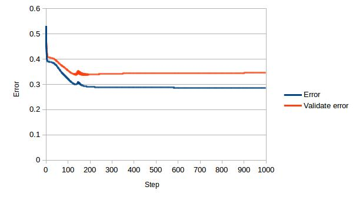

# Study on the Protein Secondary Prediction Method

## Result
ID | Hidden Layer |Units | Q3(PNAS1989) | Q3(PSSPcc)
---|--------------|------|--------------|-----------
1  |0             |0     |0.623          |0.558062
2  |1             |2     |0.632          |0.562248
3  |1             |5     |0.609          |0.560323
4  |1             |10     |0.595         |0.561387
5  |1             |20     |0.593         |0.451891


_For other settings, use 17 window size_

ID |Window size |Q3(PNAS1989)|CC\_H(PNAS1989) |CC\_E(PNAS1989) |CC\_C(PNAS1989) | Q3(PSSPcc)|CC\_H(PSSPcc) |CC\_E(PSSPcc) |CC\_C(PSSPcc)
---|------------|------------|------|------|------|------|------|------|-----------
6  |3           |0.60          |0.34|0.21|0.29|0.520697  |0.264654  |0.184842  |0.165335
7  |5           |0.606        |0.32|0.29|0.33|0.541279  |0.313990  |0.207766  |0.207611
8  |7           |0.596        |0.31|0.27|0.32|0.553834  |-0.318561  |0.229313  |0.227689
9  |9           |0.623        |0.37|0.33|0.35|0.564139  |-0.302980  |0.255499  |0.244564
10 |11          |0.616        |0.38|0.31|0.33|0.567314  |-0.285347  |0.270752  |0.247873
11 |13          |0.627        |0.38|0.33|0.37|0.568488  |-0.278217  |0.276052  |0.248251
12 |15          |0.629        |0.41|0.32|0.35|0.563579  |-0.310371  |0.273295  |0.235017
13 |17          |0.632        |0.41|0.32|0.36|0.563706  |-0.292504  |0.304342  |0.245291
14 |19          |0.626        |0.39|0.33|0.35|0.567349  |-0.308431  |0.305874  |0.247628
15 |21          |0.629        |0.39|0.31|0.35|0.570264  |-0.283892  |0.282361  |0.247920

_For other settings, use 2 HiddenLayerNode_

## Test task
1. Changes
Window size: 3-21.
Hidden units:0,2,5,10,20
2. Result Needed: Q3, CC
3. One model, for each predict protein: Q3, CC

## Steps
### Generate Train_sample.pssp, Test_sample.pssp

### Use PSSPcc for training

```{bash}
for((i=1;i<=9;i=i+1))
do
sample="Train_sample0"$i
nohup PSSPcc -s $sample".pssp" -t ../data/50_ss.txt -v ../data/50_ss_validate.txt -o $sample >$sample"_1.out" 2>$sample"_2.out" &
done

for((i=10;i<=15;i=i+1))
do
sample="Train_sample"$i
nohup PSSPcc -s $sample".pssp" -t ../data/50_ss.txt -v ../data/50_ss_validate.txt -o $sample >$sample"_1.out" 2>$sample"_2.out" &
done
```
### Get threshold for all runs
```{bash}
ls -1 *_1.out|xargs awk '{if($0~/threshold/){gsub(/threshold/,"",$0);print FILENAME"  |"$0;}}'

awk '{if($0~/threshold/){gsub(/threshold/,"",$0);print FILENAME"  |"$0;}}' Train_sample09_1.out
```
File                  |threshold
----------------------|--------
Train_sample01_1.out  |0.36
Train_sample02_1.out  |0.4
Train_sample03_1.out  |0.31
Train_sample04_1.out  |0.28
Train_sample05_1.out  |0.31
Train_sample06_1.out  |0.28
Train_sample07_1.out  |0.3
Train_sample08_1.out  |0.3
Train_sample09_1.out  |0.31
Train_sample10_1.out  |0.34
Train_sample11_1.out  |0.3
Train_sample12_1.out  |0.36
Train_sample13_1.out  |0.34
Train_sample14_1.out  |0.28
Train_sample15_1.out  |0.37

### Test
```{bash}
for((i=1;i<=9;i=i+1))
do
sample="_sample0"$i
nohup PSSPcc -s "Test"$sample".pssp" -w "Train"$sample"_weight" -b "Train"$sample"_weight_bias" -e ../data/50_ss_test.txt -o "Test"$sample >"Test"$sample"_1.out" 2>"Test"$sample"_2.out" &
done

for((i=10;i<=15;i=i+1))
do
sample="_sample"$i
nohup PSSPcc -s "Test"$sample".pssp" -w "Train"$sample"_weight" -b "Train"$sample"_weight_bias" -e ../data/50_ss_test.txt -o "Test"$sample >"Test"$sample"_1.out" 2>"Test"$sample"_2.out" &
done

rm Test*_2.out
rm *test
```

### Get 4 values
```{bash}
ls -1 Test*_1.out|xargs awk -F":" '{
if($1~/Q3/){Q3[FILENAME]=$2;}
else if($1~/CC_H/){CC_H[FILENAME]=$2;}
else if($1~/CC_E/){CC_E[FILENAME]=$2;}
else if($1~/CC_C/){CC_C[FILENAME]=$2;}
} END{for(i in Q3){print i"  |"Q3[i]"  |"CC_H[i]"  |"CC_E[i]"  |"CC_C[i];}}' |sort
```

File                 |Q3        |CC\_H      |CC\_E      |CC\_C    
---------------------|----------|----------|----------|--------
Test_sample01_1.out  |0.842043  |0.770939  |0.691307  |0.661782
Test_sample02_1.out  |0.848059  |0.785581  |0.695949  |0.677943
Test_sample03_1.out  |0.844049  |0.774071  |0.708485  |0.667742
Test_sample04_1.out  |0.850065  |0.790617  |0.694245  |0.683191
Test_sample05_1.out  |0.790964  |0.777578  |-nan  |0.581542
Test_sample06_1.out  |0.676183  |0.479623  |0.262952  |0.333712
Test_sample07_1.out  |0.735638  |0.577125  |0.547902  |0.440942
Test_sample08_1.out  |0.774802  |0.643430  |0.664031  |0.533752
Test_sample09_1.out  |0.815855  |0.729583  |0.661502  |0.620595
Test_sample10_1.out  |0.842279  |0.772121  |0.677070  |0.663542
Test_sample11_1.out  |0.845818  |0.772621  |0.687737  |0.675510
Test_sample12_1.out  |0.844638  |0.775920  |0.684166  |0.675943
Test_sample13_1.out  |0.846526  |0.785925  |0.687218  |0.675648
Test_sample14_1.out  |0.853368  |0.790540  |0.724244  |0.684596
Test_sample15_1.out  |0.847588  |0.792496  |0.677293  |0.674385

### recheck, test on train data
```{bash}
for((i=1;i<=9;i=i+1))
do
sample="_sample0"$i
nohup PSSPcc -s "Test"$sample".pssp" -w "Train"$sample"_weight" -b "Train"$sample"_weight_bias" -e ../data/50_ss.txt -o "Test_On_Train"$sample >"Test_On_Train"$sample"_1.out" &
done

for((i=10;i<=15;i=i+1))
do
sample="_sample"$i
nohup PSSPcc -s "Test"$sample".pssp" -w "Train"$sample"_weight" -b "Train"$sample"_weight_bias" -e ../data/50_ss.txt -o "Test_On_Train"$sample >"Test_On_Train"$sample"_1.out" &
done

ls -1 Test_On_Train*_1.out|xargs awk -F":" '{
if($1~/Q3/){Q3[FILENAME]=$2;}
else if($1~/CC_H/){CC_H[FILENAME]=$2;}
else if($1~/CC_E/){CC_E[FILENAME]=$2;}
else if($1~/CC_C/){CC_C[FILENAME]=$2;}
} END{for(i in Q3){print i"  |"Q3[i]"  |"CC_H[i]"  |"CC_E[i]"  |"CC_C[i];}}' |sort
```

File                 |Q3        |CC\_H      |CC\_E      |CC\_C    
---------------------|----------|----------|----------|--------
Test_On_Train_sample01_1.out  |0.798558  |0.731304  |0.540528  |0.606248
Test_On_Train_sample02_1.out  |0.837826  |0.802957  |0.633815  |0.684008
Test_On_Train_sample03_1.out  |0.815752  |0.756291  |0.617026  |0.642580
Test_On_Train_sample04_1.out  |0.840821  |0.808852  |0.615367  |0.680593
Test_On_Train_sample05_1.out  |0.775929  |0.739796  |-nan  |0.592075
Test_On_Train_sample06_1.out  |0.638824  |0.400042  |0.196189  |0.291591
Test_On_Train_sample07_1.out  |0.714032  |0.557413  |0.413433  |0.438529
Test_On_Train_sample08_1.out  |0.740322  |0.612847  |0.511628  |0.497697
Test_On_Train_sample09_1.out  |0.780588  |0.685394  |0.551532  |0.577349
Test_On_Train_sample10_1.out  |0.811204  |0.742892  |0.564395  |0.628076
Test_On_Train_sample11_1.out  |0.822407  |0.764967  |0.620467  |0.641515
Test_On_Train_sample12_1.out  |0.828397  |0.782354  |0.611072  |0.662024
Test_On_Train_sample13_1.out  |0.828064  |0.784625  |0.625292  |0.658736
Test_On_Train_sample14_1.out  |0.827177  |0.783034  |0.619261  |0.658954
Test_On_Train_sample15_1.out  |0.842041  |0.813926  |0.613605  |0.685720

### recheck test on validate data

```{bash}
for((i=1;i<=9;i=i+1))
do
sample="_sample0"$i
nohup PSSPcc -s "Test"$sample".pssp" -w "Train"$sample"_weight" -b "Train"$sample"_weight_bias" -e ../data/50_ss_validate.txt -o "Test_On_Validate"$sample >"Test_On_Validate"$sample"_1.out" &
done

for((i=10;i<=15;i=i+1))
do
sample="_sample"$i
nohup PSSPcc -s "Test"$sample".pssp" -w "Train"$sample"_weight" -b "Train"$sample"_weight_bias" -e ../data/50_ss_validate.txt -o "Test_On_Validate"$sample >"Test_On_Validate"$sample"_1.out" &
done

ls -1 Test_On_Validate*_1.out|xargs awk -F":" '{
if($1~/Q3/){Q3[FILENAME]=$2;}
else if($1~/CC_H/){CC_H[FILENAME]=$2;}
else if($1~/CC_E/){CC_E[FILENAME]=$2;}
else if($1~/CC_C/){CC_C[FILENAME]=$2;}
} END{for(i in Q3){print i"  |"Q3[i]"  |"CC_H[i]"  |"CC_E[i]"  |"CC_C[i];}}' |sort
```
File                 |Q3        |CC\_H      |CC\_E      |CC\_C    
---------------------|----------|----------|----------|--------
Test_On_Validate_sample01_1.out  |0.738277  |0.657015  |0.476956  |0.523365
Test_On_Validate_sample02_1.out  |0.740922  |0.664897  |0.486735  |0.535819
Test_On_Validate_sample03_1.out  |0.737463  |0.662279  |0.490392  |0.531121
Test_On_Validate_sample04_1.out  |0.743058  |0.668880  |0.489177  |0.535923
Test_On_Validate_sample05_1.out  |0.693826  |0.635875  |-nan  |0.455215
Test_On_Validate_sample06_1.out  |0.590072  |0.364237  |0.172241  |0.238531
Test_On_Validate_sample07_1.out  |0.65619  |0.493577  |0.357479  |0.370047
Test_On_Validate_sample08_1.out  |0.685281  |0.549993  |0.435328  |0.432671
Test_On_Validate_sample09_1.out  |0.70827  |0.599000  |0.449361  |0.474561
Test_On_Validate_sample10_1.out  |0.726172  |0.618797  |0.463119  |0.505456
Test_On_Validate_sample11_1.out  |0.730444  |0.622622  |0.475587  |0.516623
Test_On_Validate_sample12_1.out  |0.736853  |0.643330  |0.488273  |0.534274
Test_On_Validate_sample13_1.out  |0.738379  |0.660575  |0.485613  |0.530262
Test_On_Validate_sample14_1.out  |0.74499  |0.667296  |0.516155  |0.535865
Test_On_Validate_sample15_1.out  |0.74021  |0.668785  |0.474125  |0.527945

### Check for more number of proteins 677
(all 677158 proteins in PDB, that has secondary structure)

```
{bash}
for((i=1;i<=9;i=i+1))
do
sample="_sample0"$i
nohup PSSPcc -s "Test"$sample".pssp" -w "Train"$sample"_weight" -b "Train"$sample"_weight_bias" -e ../data/more_ss_test.txt -o "Test_On_more"$sample >"Test_On_more"$sample"_1.out" &
done

for((i=10;i<=15;i=i+1))
do
sample="_sample"$i
nohup PSSPcc -s "Test"$sample".pssp" -w "Train"$sample"_weight" -b "Train"$sample"_weight_bias" -e ../data/more_ss_test.txt -o "Test_On_more"$sample >"Test_On_more"$sample"_1.out" &
done

ls -1 Test_On_more*_1.out|xargs awk -F":" '{
if($1~/Q3/){Q3[FILENAME]=$2;}
else if($1~/CC_H/){CC_H[FILENAME]=$2;}
else if($1~/CC_E/){CC_E[FILENAME]=$2;}
else if($1~/CC_C/){CC_C[FILENAME]=$2;}
} END{for(i in Q3){print i"  |"Q3[i]"  |"CC_H[i]"  |"CC_E[i]"  |"CC_C[i];}}' |sort
```
File                 |Q3        |CC\_H      |CC\_E      |CC\_C    
---------------------|----------|----------|----------|--------
Test_On_more_sample01_1.out  |0.522727  |0.290059  |0.129013  |0.191439
Test_On_more_sample02_1.out  |0.487919  |0.255188  |0.123315  |0.132887
Test_On_more_sample03_1.out  |0.511942  |0.272952  |0.153713  |0.171419
Test_On_more_sample04_1.out  |0.508721  |0.276954  |0.155605  |0.181283
Test_On_more_sample05_1.out  |0.523184  |0.287768  |-nan  |0.215713
Test_On_more_sample06_1.out  |0.47138  |0.220160  |0.021360  |0.137344
Test_On_more_sample07_1.out  |0.520576  |0.281183  |0.090072  |0.223478
Test_On_more_sample08_1.out  |0.540718  |-0.301910  |0.127637  |0.249747
Test_On_more_sample09_1.out  |0.533038  |0.305666  |0.141602  |0.220494
Test_On_more_sample10_1.out  |0.524138  |0.300151  |0.153729  |0.209656
Test_On_more_sample11_1.out  |0.510045  |0.282246  |0.144797  |0.186130
Test_On_more_sample12_1.out  |0.498803  |0.271165  |0.138460  |0.153183
Test_On_more_sample13_1.out  |0.49461  |0.264076  |0.133885  |0.143752
Test_On_more_sample14_1.out  |0.515522  |0.277372  |0.167656  |0.182813
Test_On_more_sample15_1.out  |0.49974  |0.279953  |0.131028  |0.150028

### Get new training and validate data. 50 for train, 46 for validate.

```{bash}
for((i=1;i<=9;i=i+1))
do
sample="_sample0"$i
nohup PSSPcc -s "Train"$sample".pssp" -t ../data/more_ss_train.txt -v ../data/more_ss_validate.txt -o "Train_on_more"$sample >"Train_on_more"$sample"_1.out"&
done

for((i=10;i<=15;i=i+1))
do
sample="_sample"$i
nohup PSSPcc -s "Train"$sample".pssp" -t ../data/more_ss_train.txt -v ../data/more_ss_validate.txt -o "Train_on_more"$sample >"Train_on_more"$sample"_1.out"&
done

ls -1 Train_on_more*_1.out|xargs awk '{if($0~/threshold/){gsub(/threshold/,"",$0);print FILENAME"  |"$0;}}'
```

File                  |threshold
----------------------|--------
Train_on_more_sample01_1.out  |0.3
Train_on_more_sample02_1.out  |0.21
Train_on_more_sample03_1.out  |0.24
Train_on_more_sample04_1.out  |0.27
Train_on_more_sample05_1.out  |0.01
Train_on_more_sample06_1.out  |0.17
Train_on_more_sample07_1.out  |0.19
Train_on_more_sample08_1.out  |0.21
Train_on_more_sample09_1.out  |0.23
Train_on_more_sample10_1.out  |0.23
Train_on_more_sample11_1.out  |0.23
Train_on_more_sample12_1.out  |0.23
Train_on_more_sample13_1.out  |0.2
Train_on_more_sample14_1.out  |0.23
Train_on_more_sample15_1.out  |0.27


"Test_on_more"$sample".pssp"
```
{bash}
for((i=1;i<=9;i=i+1))
do
sample="_sample0"$i
nohup PSSPcc -s "Test_on_more"$sample".pssp" -w "Train_on_more"$sample"_weight" -b "Train_on_more"$sample"_weight_bias" -e ../data/more_ss_test.txt -o "Test_on_more_newtrain"$sample >"Test_on_more_newtrain"$sample"_1.out" &
done

for((i=10;i<=15;i=i+1))
do
sample="_sample"$i
nohup PSSPcc -s "Test_on_more"$sample".pssp" -w "Train_on_more"$sample"_weight" -b "Train_on_more"$sample"_weight_bias" -e ../data/more_ss_test.txt -o "Test_on_more_newtrain"$sample >"Test_on_more_newtrain"$sample"_1.out" &
done

ls -1 Test_on_more_newtrain*_1.out|xargs awk -F":" '{
if($1~/Q3/){Q3[FILENAME]=$2;}
else if($1~/CC_H/){CC_H[FILENAME]=$2;}
else if($1~/CC_E/){CC_E[FILENAME]=$2;}
else if($1~/CC_C/){CC_C[FILENAME]=$2;}
} END{for(i in Q3){print i"  |"Q3[i]"  |"CC_H[i]"  |"CC_E[i]"  |"CC_C[i];}}' |sort
```

File                 |Q3        |CC\_H      |CC\_E      |CC\_C    
---------------------|----------|----------|----------|--------
Test_on_more_newtrain_sample01_1.out  |0.558062  |-0.340757  |0.251862  |0.221031
Test_on_more_newtrain_sample02_1.out  |0.562248  |-0.310955  |0.302167  |0.240319
Test_on_more_newtrain_sample03_1.out  |0.560323  |-0.305859  |0.288345  |0.228502
Test_on_more_newtrain_sample04_1.out  |0.561387  |-0.316919  |0.284979  |0.228584
Test_on_more_newtrain_sample05_1.out  |0.451891  |-nan  |-nan  |-nan
Test_on_more_newtrain_sample06_1.out  |0.520697  |0.264654  |0.184842  |0.165335
Test_on_more_newtrain_sample07_1.out  |0.541279  |0.313990  |0.207766  |0.207611
Test_on_more_newtrain_sample08_1.out  |0.553834  |-0.318561  |0.229313  |0.227689
Test_on_more_newtrain_sample09_1.out  |0.564139  |-0.302980  |0.255499  |0.244564
Test_on_more_newtrain_sample10_1.out  |0.567314  |-0.285347  |0.270752  |0.247873
Test_on_more_newtrain_sample11_1.out  |0.568488  |-0.278217  |0.276052  |0.248251
Test_on_more_newtrain_sample12_1.out  |0.563579  |-0.310371  |0.273295  |0.235017
Test_on_more_newtrain_sample13_1.out  |0.563706  |-0.292504  |0.304342  |0.245291
Test_on_more_newtrain_sample14_1.out  |0.567349  |-0.308431  |0.305874  |0.247628
Test_on_more_newtrain_sample15_1.out  |0.570264  |-0.283892  |0.282361  |0.247920

### Random weight's accuracy
_For settings, use 17 window size, use 2 HiddenLayerNode. For the random range, use (0,0.1)_  


id | threshold | Q3
---|-----------|----
1|0.11|0.451891
2|0.13|0.451891
3|0.10|0.451891
4|0.12|0.451891
5|0.11|0.451891

### Error decrease pattern in ANN


## Conclusion
1. Since PSSPcc's Q3 is lower than PNAS(1989), It's likely that the protein available at that time has close distance. Here, distance means they share sequence similarity.
2. The accuracy of ANN for predict __any__ protein secondary structure is aroung 0.57. If predict the secondary structure of family of proteins, it's likely that the accuracy can reach very high to around 0.8.
3. According to the specific goal for prediction, one should choose proper training set (and validate set). If one want to predict a specific family of protein, use proteins similar as training. If the task is to predict any proteins, one should select proteins randomly as training set.
4. The random weight on ANN will give 0.45 accuracy(Q3).
